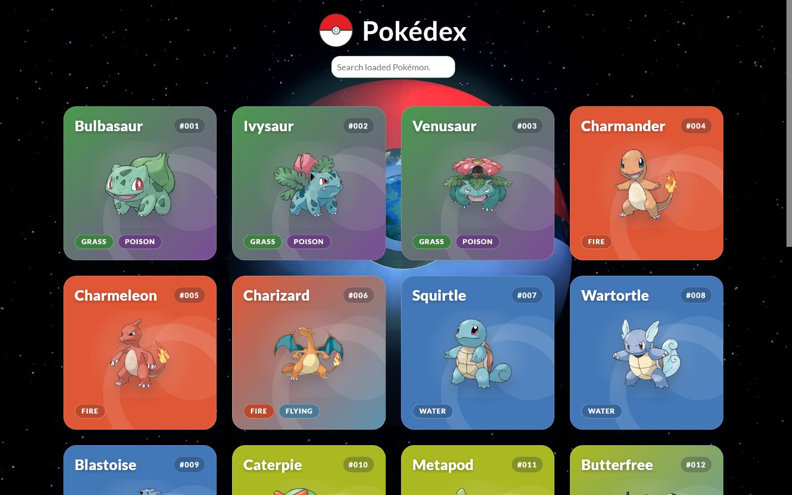
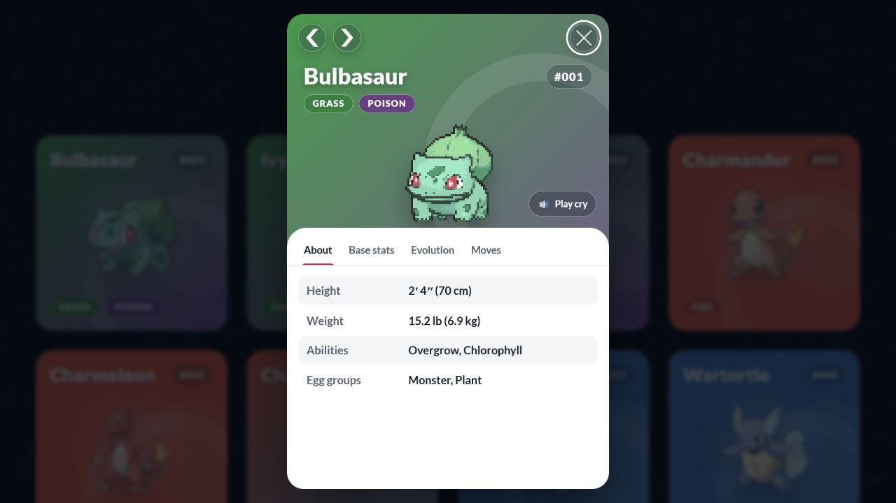

# Pokédex Explorer

A responsive Pokédex built with Vanilla JavaScript and the
[PokéAPI](https://pokeapi.co/). Browse Pokémon, search the currently loaded
collection, and inspect details, stats, moves, and complete evolution chains.

> **Live demo:** Add deployment URL here.

## Preview





## Features

- Loads Pokémon in pages of 20 using `limit` and `offset`
- Searches within the currently loaded Pokémon
- Responsive card grid and native `<dialog>` detail view
- Official artwork with animated sprites on hover
- Detail tabs for general information, base stats, evolutions, and moves
- Complete branching evolution chains, including Eevee- and Wurmple-style chains
- Plays an available Pokémon cry when details open and offers a replay button
- Caches Pokémon, species, and evolution-chain requests
- Controls parallel API and media loading while preventing duplicate requests
- Provides loading states, clear error feedback, and a retry action
- Supports keyboard navigation, focus management, accessible tabs, and reduced motion

## Technologies

- HTML5 and CSS3
- Vanilla JavaScript with ES modules
- Vite
- PokéAPI
- Vitest
- ESLint and Prettier

## Project Structure

```text
src/
├── api/       API client, request cache, and PokéAPI access
├── state/     Loaded Pokémon and pagination state
├── ui/        Request feedback and scroll locking
└── utils/     Formatters, evolution parsing, media loading, and async helpers
tests/         Formatter and evolution-parser tests
img/           Local interface and background assets
fonts/         Local font files
```

The application entry point is `src/main.js`. Existing presentation modules at
the project root handle the cards and detail dialog while shared data, state,
and utility concerns live in `src/`.

## Getting Started

### Requirements

- Node.js 20.19+ on the 20.x release line, or Node.js 22.12+
- npm

### Installation

```bash
npm install
npm run dev
```

Open the local URL printed by Vite.

## Available Scripts

| Command                | Purpose                                 |
| ---------------------- | --------------------------------------- |
| `npm run dev`          | Start the Vite development server       |
| `npm run build`        | Create the production build in `dist/`  |
| `npm run preview`      | Preview the production build locally    |
| `npm test`             | Run all Vitest tests once               |
| `npm run test:watch`   | Run tests in watch mode                 |
| `npm run lint`         | Check JavaScript with ESLint            |
| `npm run format`       | Format supported files with Prettier    |
| `npm run format:check` | Check formatting without changing files |

## Quality Checks

Vitest covers name and ID formatting, height and weight conversion, base-stat
normalization, and evolution parsing. The evolution tests include Pokémon with
no evolution as well as branching chains.

Run the complete local check with:

```bash
npm test
npm run lint
npm run format:check
npm run build
```

## Static Deployment

Create the production build:

```bash
npm run build
```

Deploy the contents of `dist/` to a static host such as GitHub Pages, Netlify,
or Vercel. Vite uses relative asset paths so the build also works below a
repository subpath. Preview the production result through `npm run preview`
rather than opening `dist/index.html` directly.

The deployed application needs an internet connection because Pokémon data,
artwork, animated sprites, and cries are requested at runtime.

## Data, Assets, and Disclaimer

Pokémon data and remote media are retrieved from the
[PokéAPI](https://pokeapi.co/) and its sprite repository.

This is an unofficial fan project created for educational and portfolio
purposes. It is not affiliated with or endorsed by Nintendo, Game Freak, or The
Pokémon Company. Pokémon names, characters, and related assets belong to their
respective rights holders.

The local files in `img/` and `fonts/` originate from the pre-existing
educational project. Their individual sources and licenses are not documented
in this repository, so this project does not grant permission to reuse them.
Before commercial redistribution, verify their licenses or replace them with
clearly licensed alternatives.

## License

No source-code license has been selected for this repository yet.
